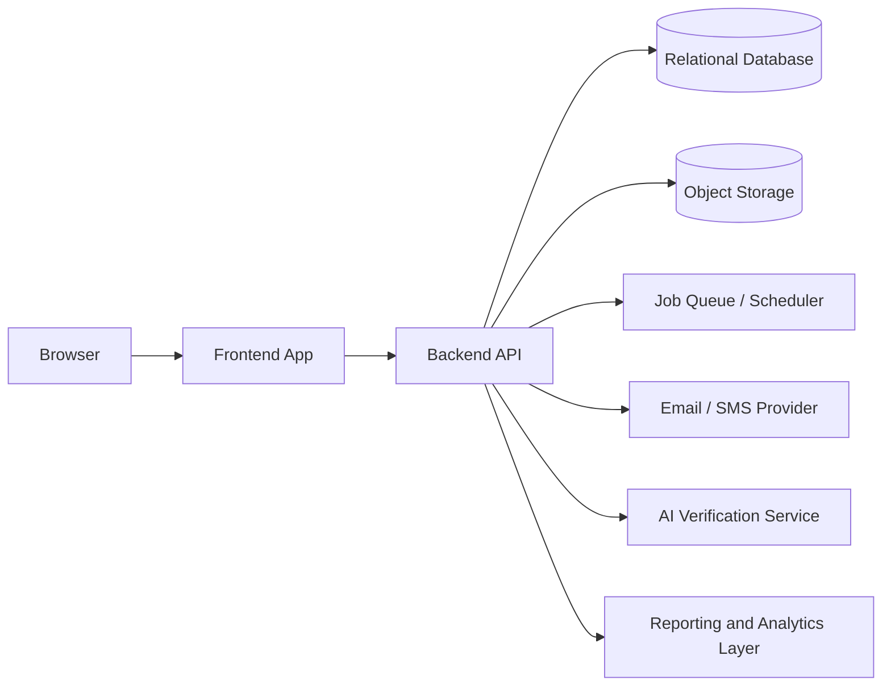

# Hostel Management Website and Portal - TRD

## 1. Technical Purpose
This document defines the technical boundaries, architecture, service contracts, data model, and non-functional requirements for the hostel management platform. It assumes the frontend and backend are separate repositories and that both must follow the same product contract.

## 2. Repository Boundaries
| Repo | Responsibilities | Should Not Contain |
| --- | --- | --- |
| Frontend repo | UI, routing, forms, dashboards, charts, client-side validation, role-specific navigation | Database logic, direct secret handling, heavy business rules |
| Backend repo | Auth, business rules, data persistence, integrations, reporting, AI gateway calls, audit logs | Presentation-heavy UI or browser-only state |

## 3. Recommended Stack
The product can be built with the following baseline stack:
- Frontend: React + Next.js, TypeScript, responsive component library, charting library.
- Backend: Node.js, Laravel, or Django with a REST API.
- Database: PostgreSQL or MySQL.
- Auth: JWT or session-based auth with refresh handling.
- Storage: S3-compatible object storage or Azure Blob for documents and attachments.
- Messaging: Email and SMS notifications through approved providers.
- Hosting: AWS or Azure with environment separation for dev, stage, and prod.

## 4. High-Level Architecture

## 5. Core Backend Services
### 5.1 Authentication and Authorization
- Login, refresh, logout, and password reset.
- Role-based access control for student, guest, warden, security, finance, admin, and super admin.
- Audit log of sign-in attempts and privileged actions.

### 5.2 Student Service
- Student profile creation, document upload metadata, approval workflow, and status tracking.
- Hostel assignment references, contact data, and emergency contacts.

### 5.3 Room Service
- Room inventory, bed capacity, allocation rules, reassignment, checkout, and vacancy tracking.
- Validation against over-capacity and duplicate assignment.

### 5.4 Billing Service
- Hostel fees, electricity charges, penalties, deposits, invoices, and payment status.
- Receipt generation and overdue reminders.

### 5.5 Mess Service
- Mess plan management, menu cycles, attendance tracking, guest meal adjustments, and monthly charge summaries.

### 5.6 Complaint Service
- Complaint creation, categorization, assignment, comments, attachments, and lifecycle status.

### 5.7 Leave Service
- Leave requests, approvals, rejection reasons, leave windows, and entry linkage.

### 5.8 Visitor and Gate Pass Service
- Visitor registration, QR generation, scan validation, gate pass issuance, entry and exit logs.

### 5.9 Reporting Service
- Occupancy, billing, complaint, leave, and visitor reports.
- Export to CSV, PDF, or structured downloads if required.

### 5.10 AI Verification Service
- Face verification or identity confirmation through a policy-approved provider.
- Risk scores and verification outcomes saved to the audit log.
- Manual override support for security staff when AI is unavailable or inconclusive.

## 6. Suggested Data Model
| Entity | Purpose | Key Fields |
| --- | --- | --- |
| users | Platform login identities | id, name, email, phone, password_hash, role_id, status |
| roles | Permission groups | id, name, permissions |
| students | Hostel resident profile | user_id, roll_number, department, year, guardian_contact, approval_status |
| rooms | Hostel rooms and beds | block, room_number, bed_count, gender_rule, status |
| room_allocations | Assign students to beds | student_id, room_id, bed_no, start_date, end_date |
| bills | Charges and invoices | student_id, billing_period, total_amount, due_date, status |
| payments | Receipts and transactions | bill_id, method, amount, paid_at, reference_no |
| mess_entries | Meal attendance and charge input | student_id, date, meal_type, charge_amount |
| complaints | Issue tracking | student_id, category, priority, status, assigned_to |
| leave_requests | Leave approvals | student_id, from_date, to_date, reason, approval_status |
| visitors | Visitor identity records | name, phone, relation, id_proof, student_id |
| gate_passes | Entry permission records | visitor_id, issue_time, valid_until, qr_code, status |
| entry_logs | Gate activity history | pass_id, entry_time, exit_time, verified_by |
| ai_verification_logs | Identity verification history | entry_log_id, provider, confidence, result, override_used |
| notifications | System messages | user_id, type, subject, body, read_at |
| reports | Generated report metadata | report_type, period, file_url, created_by |

## 7. API Surface
The backend should expose stable REST endpoints such as:
- POST /auth/login
- POST /auth/refresh
- POST /auth/logout
- GET /students
- POST /students
- GET /students/:id
- PATCH /students/:id
- GET /rooms
- POST /room-allocations
- PATCH /room-allocations/:id
- POST /billing/invoices
- GET /billing/invoices
- POST /billing/payments
- GET /mess/plans
- POST /complaints
- PATCH /complaints/:id/status
- POST /leave-requests
- PATCH /leave-requests/:id/decision
- POST /visitors
- POST /gate-passes
- POST /entry-logs/check-in
- POST /ai/verify-entry
- GET /reports/occupancy
- GET /reports/collections
- GET /analytics/complaints

## 8. Frontend Integration Contract
- The frontend should consume JSON responses only and never access the database directly.
- Every protected route should require a valid session or token.
- All role-based navigation should be driven by permissions returned by the backend.
- The backend should return field-level validation messages to support inline form errors.

## 9. AI and Identity Verification
- Face recognition or identity matching must be opt-in and policy approved.
- The backend should support pluggable AI providers so the institution can swap vendors.
- Store confidence scores, verification status, and fallback paths for manual review.
- Never expose raw biometric data to the frontend beyond what is strictly necessary.

## 10. Security and Privacy Requirements
- Hash passwords with a strong one-way algorithm.
- Enforce least privilege by role.
- Protect sensitive APIs with authorization checks and audit logs.
- Encrypt sensitive data in transit and, where needed, at rest.
- Keep a documented retention policy for visitor logs and biometric artifacts.
- Provide consent and policy review controls for face recognition use.

## 11. Non-Functional Requirements
- Availability target: 99.5 percent or higher for core operational paths.
- Fast responses for search, list views, and dashboard summaries.
- Scale to multiple hostels, blocks, and institutions if needed.
- Keep API contracts versioned so frontend and backend can evolve safely.
- Support backups, restores, and migration rollbacks.

## 12. Deployment and Environment
- Dev, stage, and prod environments with separate credentials.
- Automated database migrations.
- Environment variables for secrets, provider keys, and file storage.
- Containerized deployment preferred for repeatability.
- Use scheduled jobs for reminders, report generation, and alerts.

## 13. Observability
- Structured application logs.
- Error tracking for API failures and verification failures.
- Audit logs for approvals, allocations, billing changes, and gate activity.
- Metrics for occupancy, complaint resolution time, and verification success rate.

## 14. Technical Risks
| Risk | Mitigation |
| --- | --- |
| Frontend and backend version drift | Keep API contract and release notes versioned |
| AI vendor instability | Wrap provider access in a dedicated service layer |
| Sensitive data exposure | Use authorization, audit logs, and data minimization |
| Billing or allocation data inconsistency | Use transactions and server-side validation |
| Search and report performance issues | Add indexes and cached summaries where needed |
