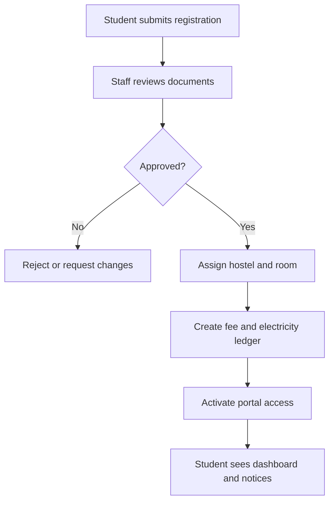
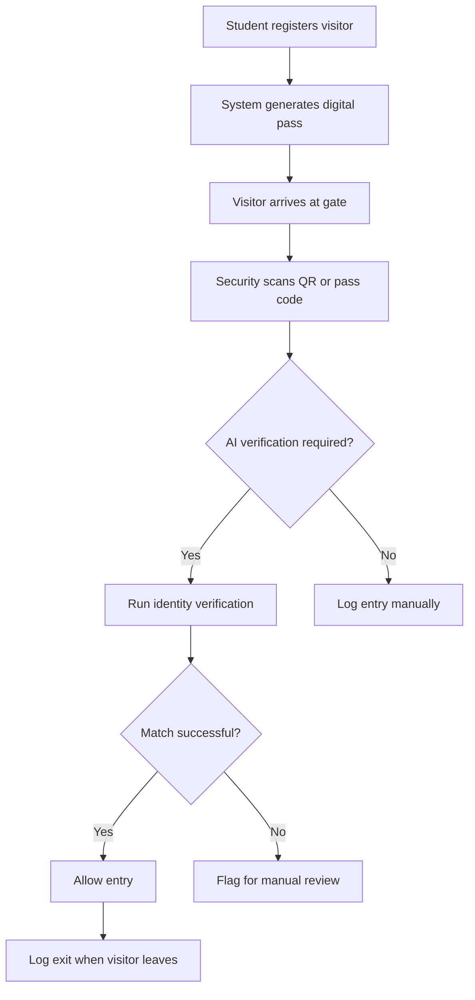

# Hostel Management Website and Portal - User Flow

## 1. Overview
This document maps the main user journeys across the separated frontend and backend repos. The flows focus on the role-based hostel experience: student, guest, warden, security, finance, and admin.

## 2. Main Actors
| Actor | Primary Goals |
| --- | --- |
| Student | Register, see room status, pay bills, raise complaints, request leave, manage visitors |
| Guest / Visitor | Enter and exit safely with valid permission |
| Warden | Approve allocations, leaves, and complaints; monitor occupancy |
| Security Staff | Verify identity, scan passes, and maintain gate logs |
| Finance Staff | Generate bills, track payments, and resolve dues |
| Hostel Admin | Configure rooms, rules, staff, and reports |

## 3. Flow 1 - Student Onboarding and Room Allocation

Steps:
1. Student fills registration details and uploads required documents.
2. Hostel staff verifies identity and eligibility.
3. If accepted, the system assigns a room and bed based on capacity and policy rules.
4. The billing ledger is initialized automatically.
5. The student gets portal access, notifications, and room details.

Alternate paths:
- If documents are incomplete, the request is returned for correction.
- If rooms are full, the student is placed in a waitlist or reassignment queue.

## 4. Flow 2 - Student Daily Usage
1. Student signs in to the portal.
2. The dashboard shows room details, dues, notices, complaints, leave status, and gate pass history.
3. Student raises a complaint with category, priority, and optional attachments.
4. Student submits a leave request when leaving the hostel.
5. Student adds a visitor request when a guest is expected.
6. Notifications update the student when staff approves, rejects, or resolves a request.

State examples:
- Complaint: open -> assigned -> in progress -> resolved -> closed
- Leave request: draft -> submitted -> approved or rejected -> completed

## 5. Flow 3 - Visitor and Gate Entry

Steps:
1. Student pre-registers the visitor or security creates the entry if policy allows.
2. The system creates a digital gate pass with a QR code and validity window.
3. At the gate, security scans the pass and checks the visitor details.
4. If enabled, AI identity verification compares the visitor or entrant against the approved record.
5. Entry and exit times are stored for audit and safety.

Alternate paths:
- Invalid QR code or expired pass leads to rejection.
- AI mismatch triggers a manual override decision by security or warden.

## 6. Flow 4 - Warden and Admin Operations
1. Warden opens the dashboard and reviews occupancy, dues, complaint queues, and pending leaves.
2. Warden approves or rejects room changes, leave requests, and complaint assignments.
3. Admin updates room inventory, rules, notices, staff permissions, and billing policies.
4. The system records every decision in the audit trail.
5. Reports are generated on demand or on schedule.

## 7. Flow 5 - Finance Operations
1. Finance staff opens the billing module.
2. The system generates hostel and electricity charges for the selected period.
3. Payments are matched to invoices and outstanding balances are updated.
4. Due reminders are sent automatically.
5. Finance staff exports collection and aging reports.

## 8. Flow 6 - Crowd Alert and Capacity Management
1. Entry volume or occupancy crosses a threshold.
2. The system raises a crowd alert.
3. Warden and security receive notifications.
4. Staff can pause new entry, redirect traffic, or manually review the situation.
5. The alert is logged for later analysis.

## 9. Exception Handling
- Missing identity proof: keep request pending until corrected.
- Room conflict: block allocation and notify admin.
- Payment failure: keep invoice open and show retry status.
- Complaint not assigned: escalate after a time threshold.
- Verification service down: fall back to manual review and log the incident.

## 10. User Experience Notes
- Keep all role-specific actions close to the dashboard home page.
- Use clear status chips for requests, bills, and approvals.
- Keep forms short and break long tasks into guided steps.
- Surface urgent items such as dues, pending leaves, and crowd alerts first.
- Make the frontend responsive so security and warden staff can use it on tablets if needed.
